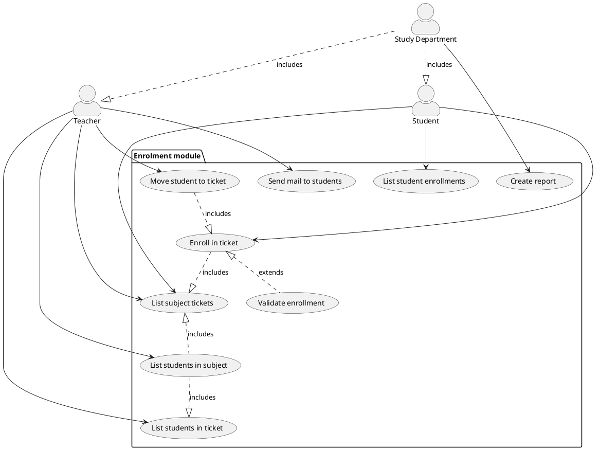

# Modul zápisy

## Zadanie

> Modul zápisy slouží k zapisování studentů do předmětů v semestrech a k zápisu na konkrétní rozvrhové lístky předmětu v rozvrhu na daný semestr. Zápis do lístku s naplněnou kapacitou je možný do čekací listiny předmětu. Student se nemůže zapsat na předmět, který má jako prerekvizitu předmět, který ještě úspěšně neabsolvoval. Dále se nemůže zapsat na předmět, který již absolvoval, pokud nemá předmět explicitně povoleny opakované zápisy. Garanti předmětu a vyučující přiřazení k jednotlivým rozvrhovým lístkům mohou vidět seznam studentů zapsaných do předmětu i na jednotlivé rozvrhové lístky a mohou jim rozesílat zprávy. Dále mohou studenty přesouvat mezi rozvrhovými lístky. Modul umožňuje vytvářet statistické reporty o počtech studentů zapsaných do předmětů a do rozvrhových lístků v jednotlivých semestrech a o podílech učitelů na výuce.

---

## Use cases:

1. __Enroll to Ticket__
   - __Description:__ Student enrolls in the given ticket.
   - __Actors:__
     - Student
     - Teacher
     - Study Department
   - __Conditions:__
     - Enrollment must be allowed (semester period, repeatable courses...)
     - Prerequisite subjects must be passed

2. __List student enrollments__
   - __Description:__ Returns list of tickets, the student is enrolled in.
   - __Actors:__ 
     - Student
     - Study Department
   - __Conditions:__
     - ???

3. __List subject tickets__
    - __Description:__ Returns list of tickets for a given subject
    - __Actors:__
      - Student
      - Teacher
      - Study Department
    - __Conditions:__
        - Subject must have some tickets associated

4. __List students in ticket__
    - __Description:__ Returns list of all students enrolled in given ticket
    - __Actors:__
      - Student
      - Teacher
      - Study Department
    - __Conditions:__
        - Teacher is teaching the given subject

4. __List students in subject__
    - __Description:__ Returns list of all students enrolled in given subject
    - __Actors:__
      - Student
      - Teacher
      - Study Department
    - __Conditions:__
        - Teacher is teaching the given subject

5. __Move student to ticket__
    - __Description:__ Enrolls student in another ticket.
    - __Actors:__
      - Teacher
      - Study Department
    - __Conditions:__
        - Student must be enrolled in another ticket of the same subject

6. __Send mail to students__
    - __Description:__ Sends an email to students of given subject/ticket.
    - __Actors:__
      - Teacher
      - Study Department
    - __Conditions__:
        - Teacher must teach the subject/ticket

7. __Create report__
    - __Description:__ Returns data with statistics report.
    - __Actors:__
      - Study Department
    - __Conditions:__
      - ???
  
8. __Validate enrollment__
   - __Description:__ Validates whether the enrollment the actor tries to commit is valid.
   - __Actors:__
     - System (Automatic)
   - __Conditions:__
     - Any actor is trying to enroll/move a student across tickets.

# TODO:
- github issue tracking (popis s template)

### adresár na analýzu požiadavok
- dokumentácia výsledku analýzy ako MD dokument
- user / system requirements ako sekcie dokumentu
- usecase diagramy ako kapitoly
- cross-referencie z kódu a ostatných častí dokumentu