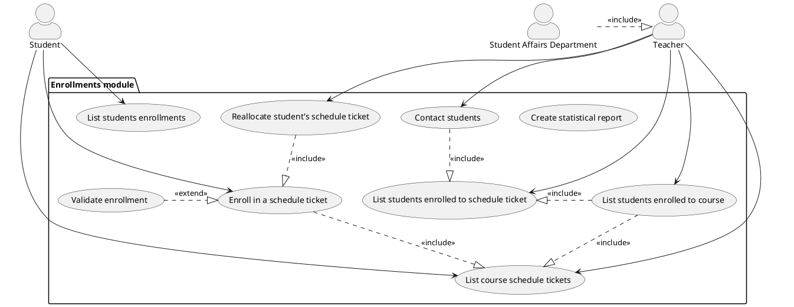

# Student information system - [*Enrollments module*]

> The module Enrollments enables to manage enrollments of students in courses in semesters and enrollments in specific schedule tickets in a given semester according to the planned schedule. Enrollment in a ticket with a filled capacity is possible but only in the waiting list of the subject. A student cannot enroll in a course that has a prerequisite course that he / she has not yet completed successfully. Furthermore, he / she cannot enroll in a course that he / she has already completed, unless the course is explicitly specified with to repeated enrollments allowed. Course guarantors and teachers assigned to individual timetables can see the list of students enrolled in the course and individual timetables and can send them email messages. Furthermore, they can reallocate students between schedule sheets defined in the schedule for the given semester. The module enables to create statistical reports on the number of students enrolled in subjects and timetables in individual semesters and on the teaching shares of teachers.

## Functional Requirements

This section specifies the functional requirements.

### User requirements

- Student shall be able to enroll in a course and into a schedule ticket.
- Student shall be able to delist from the schedule ticket he is enrolled in.
- Student should have the possibility to change a schedule ticket.
- Teacher shall be able to list all students enrolled in a given schedule ticket.
- Teacher can send a message / e-mail to all students enrolled in the course / schedule ticket led by the teacher.
- System creates statistical report on the number of students enrolled as well as teaching shares of teachers.

### System requirements

[*Document here your system requirements as use case diagrams.*]

#### Actors

[*Document here all actors from the use case diagrams. Make a subsection for each actor and their short description in each subsection.*]

##### Student

Student actor represents a university student who will use the student information system as a main method of interaction between him and the university. 

##### Teacher / Course garantor

Teacher / Course garantor actor is a representation of an academic employee who is responsible for holding the lectures and/or practical tutorials.

##### Student Affairs Department

Student Affairs Departement actor represents a university / faculty department responsible for dealing with administration and control related tasks as well as helping students dealing with various types
of problems they may encounter during their studies.

#### Use cases

##### Enrollments module use case diagram

[*Describe the diagram in a short paragraph. Describe each use case from the diaram in the detail from the lecture in a separate subsection.*]

###### Enroll in a schedule ticket

###### Validate enrollment

###### List course schedule tickets