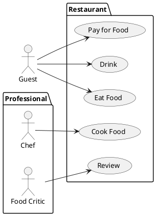

# Student information system - [*Enrollments module*]

[*Module description*]

## Functional Requirements

This section specifies the functional requirements.

### User requirements

[*List of user requirements*]

### System requirements

[*Document here your system requirements as use case diagrams.*]

#### Actors

[*Document here all actors from the use case diagrams. Make a subsection for each actor and their short description in each subsection.*]

##### [*Actor name*]

[*Actor description*]

#### Use cases

[*Document here all use cases. Create a subsection for each use case diagram. If you have only one use case diagram, you do not need a special subsection*]

##### [*Use case diagram title*]

[*Use case diagram in PlantUML*]

[*Describe the diagram in a short paragraph. Describe each use case from the diaram in the detail from the lecture in a separate subsection.*]

###### [*Use case title*]

[*Use case description in the structure from the lecture.*]