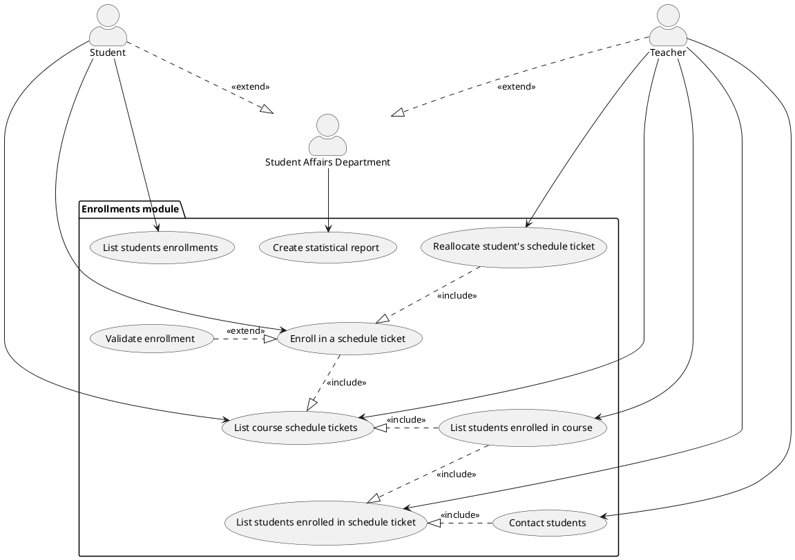

# Student information system - Modul zápisy

## Zadanie

> Modul zápisy slouží k zapisování studentů do předmětů v semestrech a k zápisu na konkrétní rozvrhové lístky předmětu v rozvrhu na daný semestr. Zápis do lístku s naplněnou kapacitou je možný do čekací listiny předmětu. Student se nemůže zapsat na předmět, který má jako prerekvizitu předmět, který ještě úspěšně neabsolvoval. Dále se nemůže zapsat na předmět, který již absolvoval, pokud nemá předmět explicitně povoleny opakované zápisy. Garanti předmětu a vyučující přiřazení k jednotlivým rozvrhovým lístkům mohou vidět seznam studentů zapsaných do předmětu i na jednotlivé rozvrhové lístky a mohou jim rozesílat zprávy. Dále mohou studenty přesouvat mezi rozvrhovými lístky. Modul umožňuje vytvářet statistické reporty o počtech studentů zapsaných do předmětů a do rozvrhových lístků v jednotlivých semestrech a o podílech učitelů na výuce.

---

## Functional Requirements

This section specifies the functional requirements.

## User requirements

- Student shall be able to enroll in a course and into a schedule ticket.
- Student shall be able to delist from the schedule ticket he is enrolled in.
- Student should have the possibility to change a schedule ticket.
- Teacher shall be able to list all students enrolled in a given schedule ticket.
- Teacher can send a message / e-mail to all students enrolled in the course / schedule ticket led by the teacher.
- System creates statistical report on the number of students enrolled as well as teaching shares of teachers.

## System requirements

[*Document here your system requirements as use case diagrams.*]

## Actors

### Student

Student actor represents a university student who will use the student information system as a main method of interaction between him and the university. 

### Teacher / Course garantor

Teacher / Course garantor actor is a representation of an academic employee who is responsible for holding the lectures and/or practical tutorials.

### Student Affairs Department

Student Affairs Departement actor represents a university / faculty department responsible for dealing with administration and control related tasks as well as helping students dealing with various types
of problems they may encounter during their studies.

## Use cases

### Enroll in a schedule ticket

#### _Starting situation (Initial assumption)_

- A user with access to the enrollment module for specific student &ndash; student or study department &ndash; has opened the enrollments form and has chosen a course and a specific course schedule ticket he / she wants to be enrolled in.

#### _Normal_

- A user opens the enrollments form.
 
- The user fills information about the course for enrollment.

- System fetches all available schedule tickets for given course and provides them to the user.

- The user completes the enrollment request by making a choice about the desired schedule ticket and filling it in the request.

- The user sends an enrollment request.

- System performs the validation of the enrollment request.

- System updates chosen schedule ticket (or schedule ticket waiting waiting list if no free tickets are available).

- System updates the structures where information about student's enrolled courses and schedule tickets are stored.

- System checks that changes have been saved successfully.

- System notifies the user about successful completion.

#### _What can go wrong_

- System does not find any available schedule tickets for given course.

- The user sends enrollment request which is not filled correctly.

- Enrollment validation process fails.

- System is unable to find or update the structures holding information about the enrollment.

_System state on completion_

- The enrollment request is valid and the process has finished successfully. The information about the enrollment of a student in a schedule ticket is now available in the system. Student is notified about the successful completion.

- In case of enrollment validation failure or final system state validation failure, all changes in the system are rolled back &ndash; the state of the system returns to the last valid state. The student is notified about the failure.

### Validate enrollment

_Starting situation (Initial assumption)_

- A user with access to the enrollment module for specific student has initiated the enrollment process for a specific course and schedule ticket. Furthermore, a request for enrollment has been filled and sent for execution.

#### _Normal_

- System checks whether enrollments are currently allowed (period in the semester).

- System checks whether all required data are filled in.

- System checks the existence of a student and his/her current study status before inspecting successful completion of prerequisities (if any).

- System reviews that the student has not already completed the course or that the course allows repeated enrollments.

- System checks current number of free tickets for chosen schedule ticket.

#### _What can go wrong_

- Enrollments are not allowed in current period. Enrollment process stops and the user is notified about the failure.

- Course in which a user tries to enroll does not exist. In such a case, the student is notified about the fact, and enrollment process fails.

- Course in which a student tries to enroll is not being taught this semester. In such a case, the user is notified about the fact, and enrollment process fails.

- A student tried to enroll in a course, but prerequisities are not satisfied &ndash; at least one prerequisity has _not_ been successfully completed. The user recieves a notification / message about failed enrollment.

- A student tried to enroll in a course, which he had already completed and the course does not allow repeated enrollments. The user is notified about the situation and enrollment process is not finished.

#### _System state on completion_

- System has validated all requirements for enrollment of a student in a given course and
  no errors have been detected. The enrollment is considered valid and system update may proceed.

- If any of the requirements for successful enrollment is not satisfied, enrollment validation fails. System is requested to stop the enrollment process and roll back all changes made to the system.

### List course schedule tickets

#### _Starting situation (Initial assumption)_

- A user has opened the enrollments form, has filled in information about the course for which the schedule tickets should be listed and has sent the request.

#### _Normal_

- The user sends the request for listing schedule tickets for given course.

- System performs the search for available schedule tickets given provided information in the request.

- System collects found schedule tickets and provides them to the user.

#### _What can go wrong_

- The user is not permitted to list the schedule tickets for given course.

- System does not find any course which matches information and requirements from the request.

- The system does not find any available schedule tickets for given course.

#### _System state on completion_

- The system fetches all available schedule tickets for the desired course. The user is now able to list the schedule tickets.

- In case of incorrectly filled request or any other failure, the system does not fulfill the request to list schedule tickets and notifies the user about failed operation.

1. __Enroll to Ticket__
   - __Description:__ Student enrolls in the given ticket.
   - __Actors:__
     - Student
     - Teacher
     - Study Department
   - __Conditions:__
     - Enrollment must be allowed (semester period, repeatable courses...)
     - Prerequisite subjects must be passed

2. __List student enrollments__
   - __Description:__ Returns list of tickets, the student is enrolled in.
   - __Actors:__ 
     - Student
     - Study Department
   - __Conditions:__
     - ???

3. __List subject tickets__
    - __Description:__ Returns list of tickets for a given subject
    - __Actors:__
      - Student
      - Teacher
      - Study Department
    - __Conditions:__
        - Subject must have some tickets associated

4. __List students in ticket__
    - __Description:__ Returns list of all students enrolled in given ticket
    - __Actors:__
      - Student
      - Teacher
      - Study Department
    - __Conditions:__
        - Teacher is teaching the given subject

5. __List students in subject__
    - __Description:__ Returns list of all students enrolled in given subject
    - __Actors:__
      - Student
      - Teacher
      - Study Department
    - __Conditions:__
        - Teacher is teaching the given subject

6. __Move student to ticket__
    - __Description:__ Enrolls student in another ticket.
    - __Actors:__
      - Teacher
      - Study Department
    - __Conditions:__
        - Student must be enrolled in another ticket of the same subject

7. __Send mail to students__
    - __Description:__ Sends an email to students of given subject/ticket.
    - __Actors:__
      - Teacher
      - Study Department
    - __Conditions__:
        - Teacher must teach the subject/ticket

8. __Create report__
    - __Description:__ Returns data with statistics report.
    - __Actors:__
      - Study Department
    - __Conditions:__
      - ???
  
9. __Validate enrollment__
   - __Description:__ Validates whether the enrollment the actor tries to commit is valid.
   - __Actors:__
     - System (Automatic)
   - __Conditions:__
     - Any actor is trying to enroll/move a student across tickets.